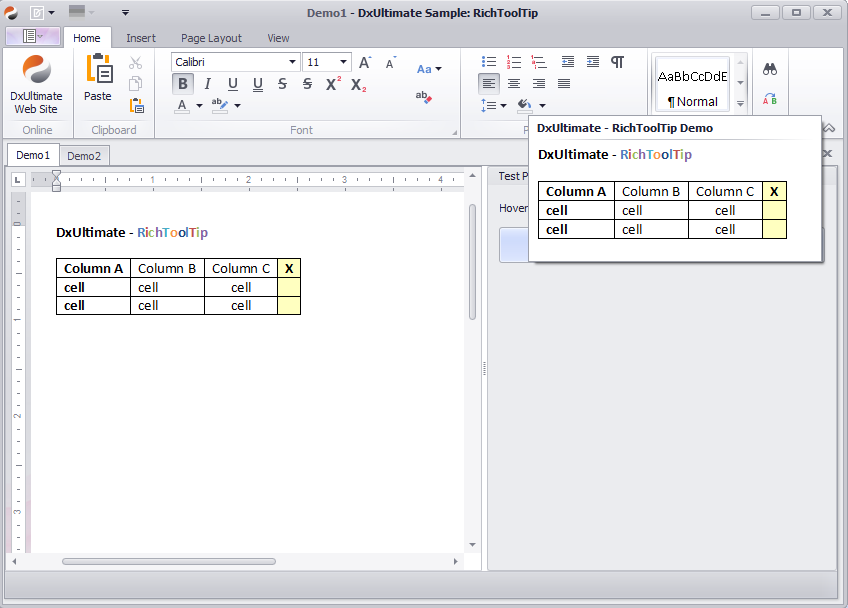
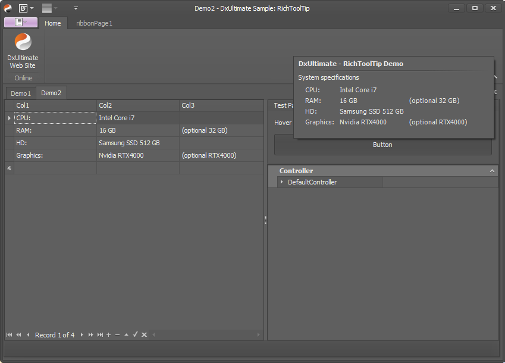
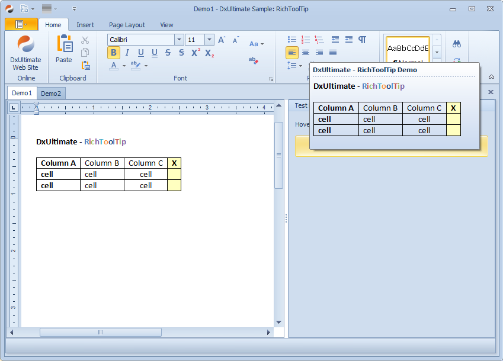
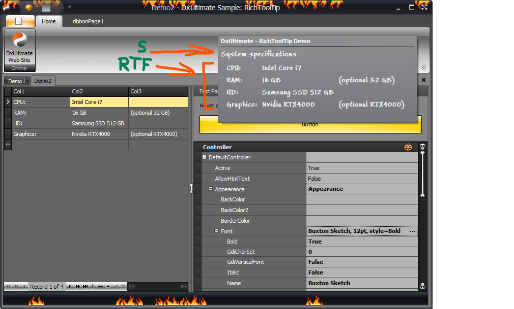

## DxUltimate Sample: RichText ToolTip for DevExpress 

### 1. Introduction 

I while ago I found myself in a situation where I needed to be able to display -formatted text in a ToolTip which is aligned in columns.
When you don't find it visually acceptable to accomodate with the clumsy appearance of a monospaced font, there are not really any options left - not even with the DX SuperTip. It allows some simplified HTML markup for formatting but it doesn't support 'real' HTML/CSS for table or column layouts.

### 2. Impossible?

DX Support says so - there are quite a few tickets asking for that or similar:

- [Format text in the SuperToolTip](https://supportcenter.devexpress.com/ticket/details/cq54687/format-text-in-the-supertooltip)
- [Is there a way to lineup text in a SuperToolTip?](https://supportcenter.devexpress.com/ticket/details/t635537/is-there-a-way-to-lineup-text-in-a-supertooltip)
- [SuperToolTip - show table/grid content (columns)](https://supportcenter.devexpress.com/ticket/details/t567673/supertooltip-show-table-grid-content-columns)
- [help me adjust the tooltip text](https://supportcenter.devexpress.com/ticket/details/t382037/help-me-adjust-the-tooltip-text)
- [Format text in the SuperToolTip](https://supportcenter.devexpress.com/ticket/details/cq54687/format-text-in-the-supertooltip)
- [Can I format a SuperTip to look like a grid?](https://supportcenter.devexpress.com/ticket/details/q369877/can-i-format-a-supertip-to-look-like-a-grid)
- [Supertip: Able to add images into the body text?](https://supportcenter.devexpress.com/ticket/details/t596580/supertip-able-to-add-images-into-the-body-text)


### 3. Solution

From the perspective of the usage side, it would have been most convenient to modify the tooltip display in a way that it supports an extended set of html features for rendering, but developing that from scratch is a ridiculous amount of work and using one of the established browser engine to offload the rendering would introduce dependencies, bloat-up the application and waste resources - just to display a tooltip..
That's how I came to using RichText instead. RichText rendering is fast and almost part of the Windows OS - at least, the related dlls are typically loaded already, no matter whether we use them for tooltip display or not.

This solution consists of two parts: 

#### Part #1: Rendering RTF text inside a SuperTip

This is done in full accordance to the DX pattern: **RichToolTipItem** is implemented as an additional descendant of **BaseToolTipItem**
The RichToolTipItem is accompanied by appropriate implementations of ViewInfo and ItemPainter

##### RichToolTipItem Properties

- LeftIndent
- MaxWidth (inherited)
- MaxHeight
- Text - RTF text

#### Part #2: Programmatically creating RTF for display


**RichTextTableBuilder** is a helper that creates an RTF document containing a table layout.

Its **CreateTable()** method takes a 2-dimensional string array for the table data and a DX **AppearanceObject**. 

The RTF is generated in a way that the styles are exactly matching 

- the currently active Skin
  plus
- the settings applied via the **ToolTipManager**'s **Appearance** setting.

Screenshot 4 demonstrates this by showing two tooltip sections: a regular one and a RichToolTip section. Both are rendered ín the exact same way.


### 4. Examples

#### Screenshot 1

Tooltip shows the content of the current RichText document:



#### Screenshot 2

The DataGrid contents are converted to a RichText table with three columns which is shown in the Tooltip:



#### Screenshot 3

The RichText content is rendered with a transparent background and doesn't affect the Tooltip background, even when it is using a gradient:



#### Screenshot 4

The row marked with 'S' is a regular Tooltip section. As long as the RTF text doesn't have inline styles, it renders with the Appearance settings (font, colors, etc.) defined in the Tooltip:




### 5. Usage

#### Create a RichToolTipItem

```cs
            var tip = new SuperToolTip();
            tip.Items.AddTitle(title);
            tip.Items.AddSeparator();

            var richItem = new RichToolTipItem();

            richItem.Text = this.richEditControl1.RtfText;
            tip.Items.Add(richItem);
```
   
#### Create a RichText Document with Table Layout

```cs
            var cells = new string[this.list.Count,3];

            for (int i = 0; i < this.list.Count; i++)
            {
                cells[i, 0] = this.list[i].Col1;
                cells[i, 1] = this.list[i].Col2;
                cells[i, 2] = this.list[i].Col3;
            }

            var richItem = new RichToolTipItem();
            richItem.MaxWidth = 600;
            richItem.Appearance.Assign(this.defaultToolTipController1.DefaultController.Appearance);

            richItem.LeftIndent = 8;
            var appearance = richItem.GetPaintAppearance();
            var rtf = RichTextTableBuilder.CreateTable(cells, appearance);

            richItem.Text = rtf;

            tip.Items.Add(richItem);
            tip.MaxWidth = 600;
```
